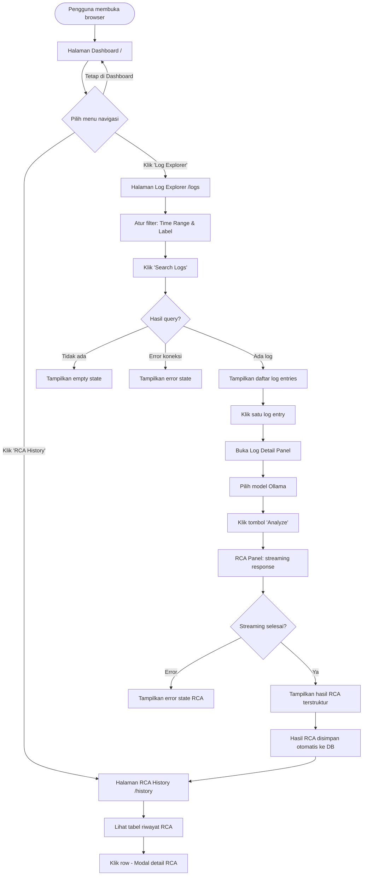
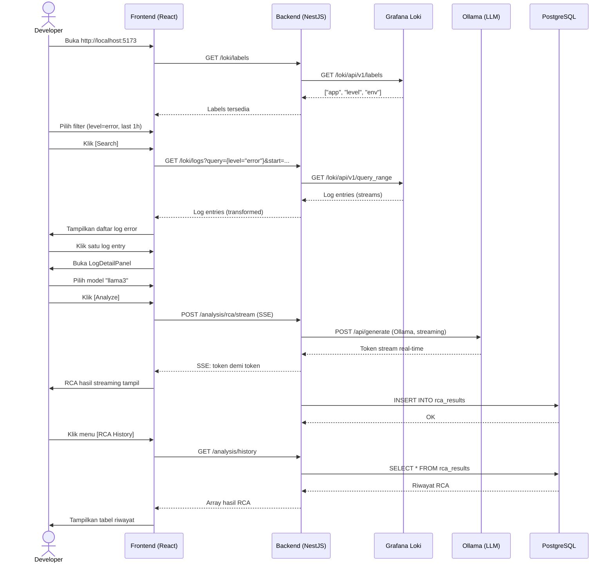

# User Flow — Mini-Grafana Frontend
> Dokumen ini mendeskripsikan alur penggunaan antarmuka pengguna (frontend) sistem Mini-Grafana untuk keperluan penelitian skripsi.

---

## 1. Gambaran Umum Alur Sistem



---

## 2. Halaman Dashboard (`/`)

**Tujuan:** Memberikan ringkasan cepat kondisi sistem dan status koneksi layanan.

### Alur Pengguna:
```
Buka aplikasi
    └─▶ Dashboard ter-load otomatis
            ├─▶ Health check Loki (hit /loki/labels)
            │       ├─▶ ✅ Loki Online  → badge hijau
            │       └─▶ ❌ Loki Offline → badge merah
            ├─▶ Health check Ollama (hit /ollama/models)
            │       ├─▶ ✅ Ollama Online  → badge hijau
            │       └─▶ ❌ Ollama Offline → badge merah
            ├─▶ Tampilkan total error count (time range default: 1 jam terakhir)
            ├─▶ Tampilkan error trend chart (line chart per waktu)
            └─▶ Tampilkan 5 hasil RCA terakhir (dari /analysis/history)
```

### Komponen yang terlibat:
| Komponen | Fungsi |
|----------|--------|
| `HealthStatus` | Indikator koneksi Loki & Ollama |
| `ErrorCountCard` | Total error dalam time range |
| `ErrorTrendChart` | Grafik tren error per waktu |
| `RecentRcaList` | Daftar 5 RCA terbaru |

---

## 3. Halaman Log Explorer (`/logs`)

**Tujuan:** Eksplorasi dan penelusuran log error dari Loki secara interaktif.

### Alur Pengguna:

#### 3.1 Filter & Query Log
```
Masuk ke halaman Log Explorer
    └─▶ Form filter ter-load
            ├─▶ TimeRangeSelector
            │       ├─▶ Pilih preset: [1 Jam] [6 Jam] [24 Jam] [7 Hari]
            │       └─▶ Atau pilih custom date range
            ├─▶ LabelFilter
            │       ├─▶ Fetch labels dari GET /loki/labels
            │       └─▶ Pilih kombinasi label (misal: app=myapp, level=error)
            └─▶ Klik tombol [Search]
                    └─▶ Kirim GET /loki/logs dengan query LogQL yang di-build otomatis
```

#### 3.2 Melihat Hasil Log
```
Request berhasil
    └─▶ Tampilkan daftar LogItem secara berurutan (terbaru di atas)
            ├─▶ Setiap LogItem menampilkan:
            │       ├─▶ Timestamp (format: dd/MM/yyyy HH:mm:ss)
            │       ├─▶ Severity badge (ERROR=merah, WARN=kuning, INFO=biru, DEBUG=abu)
            │       └─▶ Log message (truncated 120 karakter)
            └─▶ Status: Loading → Data → Empty/Error
```

#### 3.3 Detail Log & Analisis RCA
```
Klik satu LogItem
    └─▶ LogDetailPanel terbuka (side panel)
            ├─▶ Tampilkan full log message
            ├─▶ Tampilkan semua labels (key-value)
            ├─▶ Tampilkan timestamp lengkap
            ├─▶ ModelSelector: dropdown pilih model Ollama
            │       └─▶ Fetch dari GET /ollama/models
            └─▶ Klik tombol [Analyze]
                    └─▶ RCA Panel muncul di bawah
                            ├─▶ Streaming SSE ke POST /analysis/rca/stream
                            ├─▶ Token LLM tampil real-time (streaming)
                            └─▶ Setelah selesai: tampilkan 3 section terstruktur
                                    ├─▶ 🔍 Penyebab (root_cause)
                                    ├─▶ ⚠️ Dampak (impact)
                                    └─▶ ✅ Rekomendasi (recommendation)
```

---

## 4. Halaman RCA History (`/history`)

**Tujuan:** Melihat riwayat seluruh hasil analisis root cause yang pernah dilakukan.

### Alur Pengguna:
```
Masuk ke halaman RCA History
    └─▶ Fetch data dari GET /analysis/history
            └─▶ Tampilkan tabel HistoryTable
                    ├─▶ Kolom: Timestamp | Log Snippet | Model | Root Cause Preview
                    ├─▶ Filter/search berdasarkan: tanggal atau keyword
                    └─▶ Klik satu row
                            └─▶ Modal detail terbuka
                                    ├─▶ Full log message
                                    ├─▶ Labels
                                    ├─▶ Model yang digunakan
                                    ├─▶ 🔍 Penyebab
                                    ├─▶ ⚠️ Dampak
                                    └─▶ ✅ Rekomendasi
```

---

## 5. Alur Lengkap Skenario Penggunaan Utama

> **Skenario:** Developer menemukan error di sistem produksi dan ingin menganalisis penyebabnya menggunakan Mini-Grafana.



---

## 6. State Management per Halaman

| Halaman | State Utama | Sumber Data |
|---------|-------------|-------------|
| Dashboard | `lokiStatus`, `ollamaStatus`, `errorCount`, `errorTrend`, `recentRca` | `/loki/labels`, `/ollama/models`, `/loki/logs`, `/analysis/history` |
| Log Explorer | `logs`, `labels`, `selectedLog`, `filters`, `rcaResult` | `/loki/logs`, `/loki/labels`, `/analysis/rca/stream` |
| RCA History | `history`, `selectedItem` | `/analysis/history` |

---

## 7. Error States & Edge Cases

| Kondisi | Perilaku UI |
|---------|-------------|
| Loki tidak bisa diakses | Dashboard: badge merah; Log Explorer: error banner |
| Ollama tidak running | ModelSelector disabled; tombol Analyze disabled |
| Query log tidak ada hasil | Empty state dengan ikon + pesan informatif |
| RCA streaming gagal di tengah jalan | Error state di RCA Panel + tombol retry |
| Request timeout (>30s) | Toast notifikasi error |

---

## 8. Navigasi Antar Halaman

```
[Dashboard]  ←→  [Log Explorer]  ←→  [RCA History]
     ↑                  ↑                   ↑
     └──────── Navbar (sticky top) ─────────┘
```

- Navbar selalu terlihat di semua halaman (sticky)
- NavLink aktif ditandai dengan highlight warna primary
- Route fallback (`*`) redirect ke Dashboard

---

> 📌 **Catatan untuk Penelitian:**
> Dokumen ini menggambarkan alur ideal berdasarkan PRD versi 0.1.0. Implementasi aktual mengikuti fase pengembangan yang tercatat di [`tasks.md`](./tasks.md).
